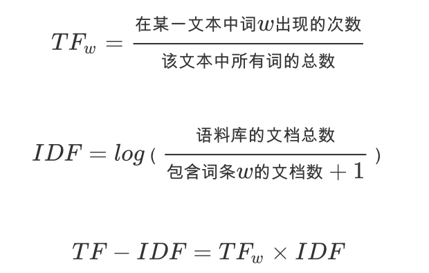

# nlp_tutorial
## 前言
NLP自然语言处理，到底是怎么处理的，有哪些常用的方法和思路，恰逢项目需要，借由本篇教程梳理NLP解决实际问题的一般思路。

这篇教程期待你本身对于NLP的知识有一定的了解，知晓NLP包括哪些部分（词，句，段，篇章等），知晓NLP有哪些应用（相似度，分类，生成等），反正，你从这个项目里是看不到这些基础知识的。

相反，这里会给你描述一般情况下，项目中NLP需要面对的业务场景和需要解决的问题，以及可以采取的思路和方案，当然，还有亲自实践，有code。


## NLP面临的常见业务场景

巨量的文本信息，可能是短文本，几句话；也可能是长文本，文章或新闻报道。而且通常样本没有标注，不读其文，难知其义，更难知其类别。而真实的需求，往往和业务紧密结合，需要从这些文本信息中获取某些有价值的业务数据，获取某种隐藏的规律等等。


## 具体场景中NLP的通用思路

没有标注的巨量文本数据，首先需要解决的就是文本的结构化。长文本由段落组成，段落其实相当于短文本，段落或者短文本由句子组成，句子则有词组成，词是NLP中的最小处理单元，所以NLP的关键，往往是分词。（这里只给解决思路，实际在分词前，还需要完成分段，断句等准备工作）

### 分词

分词的方法有多种，有基于词典的，有基于统计概率的，理论算法的描述网上不胜枚举，也可以看看吴军先生的《数学之美》。这里只告诉你，项目中应该怎么分词，有哪些开源项目可以帮助你。

实际项目中分词的过程可能是最最重要的。分词，是在为后续的处理准备最初级的原材料，这一步如果贴近业务，准确度高，就决定了后续的每一步都有一个可靠的基础，相反NLP的每一步都或多或少带有误差累积的顽疾，如果分词的准确度不高，后续的NLP处理也极难有较好的结果。

原始分词，工具可以使用[jieba分词](https://github.com/fxsjy/jieba)，当然，也可以使用[HanLP](https://github.com/hankcs/HanLP)，其中jieba是python实现的，HanLP是Java实现的，本身没有绝对的鸿沟，使用那个，随意就好。

选取开源工具的一个关键条件是：支持自定义词库！理由很明显，实际的业务场景总是有很多的专业名词，这些词不太可能在通用词库里有包含。比如：会议控制，业务场景里其实是一个词，但是通用的词库一般都会分成“会议”和“控制”两个词。

### 去除停用词

分词之后就要去除停用词，当然，这里停用词涵盖代词，副词等等。这里的去除停用词，更像是去除和语义关系不大的词，例如下面这段文本：

> “我的电脑不能开机了，怎么办呢？请帮帮忙，谢谢～”

其实，关键信息就两个词：电脑（对象）不能开机（状态），当然，你也可以分成三个词，电脑+不能+开机，根据业务场景来定，如果不能开机在当下的场景里出现的可能性更高，最好就划为一个词。那么其他的文字信息呢，例如：我的，了，怎么办呢，请帮帮忙，谢谢，这些和当下场景的语义无关，必须要去除掉。

通过这个过程，可以发现，分词，以及去除停用词的标准和实际的业务场景有紧密的关系，所以，基于NLP来解决业务问题的前提就是要足够了解当前的业务场景。

去除停用词，也有开源工具可以使用，包括[jieba](https://github.com/fxsjy/jieba)等，不过这个逻辑比较简单，自己实现也未尝不可。

### 处理同义词或同类词

同义词，并不是传统意义上的同义词，正确的解释应该是基于具体的业务场景下可以彼此替换的词，比如在求助邮件的场景下，“\*\*打不开”和“\*\*打开失败”其实是一个意思，所以需要总结出业务场景下的一个同义词词典，然后对于分词的结果进行同义词替换，替换是比较粗暴的做法，但是对于后续生成词向量，计算相似度非常有效。

对于同义词的处理，也有比较细腻的方法，就是标注，对分词的结果进行同义词，同类词和相关词标注，标注的结果类似于这样：

> ```
> 去年底/t/ 国家/n/Di02A01= 深度/ns/Dn01A10= 贫困地区/n/
> ```

其中第一个标注的字段是词性，名称，动词，形容词等，第二个标注则是基于哈工大词义语料标注进行的同义，同类或相关词标注，哈工大的语料对应了5个层级的分类，标注的含义即是当前这个词属于5级分类的详细信息，细节可以参看：[哈工大词林](https://www.ltp-cloud.com/download/)。后续在计算相似度上如果可以合理的应用词的标注信息，会对计算结果有较好的改进。

但是，必须强调一点，词标注并不是必须的，他是锦上添花，不是救命稻草。

最后，一定记得把词的处理结果**临时保存**下来。

### 生成词向量

基于分词的结果就可以生成每一个词的词向量，这里列举目前比较流行的两种方式：TF-IDF和Word2Vec。

#### TF_TDF

TF-IDF的计算相对简单：(之所以要插个图片这么丑，因为github不支持LaTex，codecogs不支持中文导致的)



也有不少开源工具支撑，常用的是[scikit-learn](http://scikit-learn.org/stable/)，这里就不介绍用法了，scikit-learn的用户体验很友好，看看官方文档就能即可上手。

#### Word2Vec

Word2Vec从原理上讲就要复杂一些，这东西是Google团队搞的一种算法，官网和源码在这里[Word2Vec](https://code.google.com/archive/p/word2vec/)，内部算法有两种：CBOW(Continuous Bag of Words)，Skip-gram。简单理解就是：

* CBOW：根据上下文来预测词的概率，上下文所有词对于当前词出现概率的影响权重是一致的。
* Skip-gram：正好相反，根据当前词预测上下文出现的概率。

到这里不要被算法迷糊了双眼，Word2Vec最终的输出依然是词向量，只不过这里的词向量是算法中概率最大的模型参数而已。

同样，Word2Vec也有很多开源工具的支持，除了Google开放的源码，还有[gensim](https://radimrehurek.com/gensim/)和DeepLearning4J(https://deeplearning4j.org/)，其中gensim对于python友好，DL4J对于java友好。

### 文本聚类

//todo：

### 文本分类

//todo：

###未完待续

